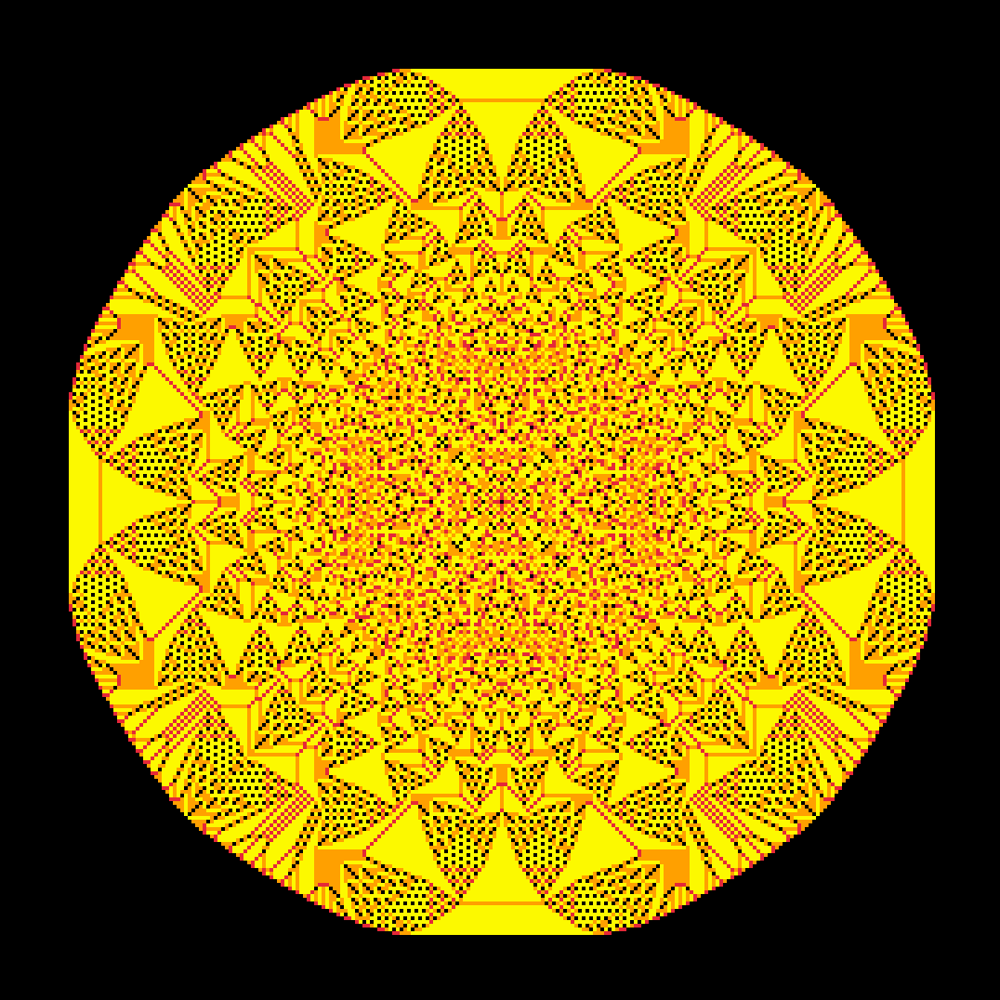

# Abelian sandpile model in Rust 🦀

See more:
- https://en.wikipedia.org/wiki/Abelian_sandpile_model
- https://youtu.be/1MtEUErz7Gg

To run:
```bash
cargo run --release --example main
```

Used:
- [macroquad](https://github.com/not-fl3/macroquad)
- [rayon](https://github.com/rayon-rs/rayon)


